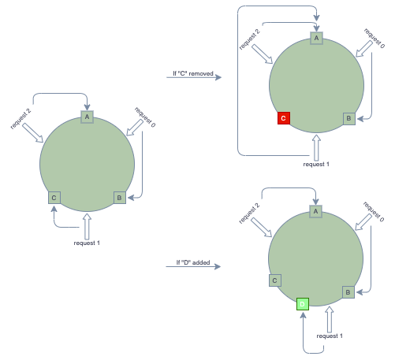

# Architecture Guide 架构设计
主要说明一些架构设计中的问题和解决方案。

## API Design 接口设计

__幂等性__

对于创建类的业务请求，必须要实现幂等性，才能防止重复创建问题，如：重复创建订单、交易等等。

业界常见两种针对同一请求的返回设计：

```text
POST               
     req       ---
------------> |   |
    error     | S |
<------------ |   |
               ---  

GET
     req        ---
------------>  |   |
    200 OK     | S |
<------------  |   |
                ---
```
第一种情况：

针对重复的 POST 请求 返回 error "duplicated request"，同时提供一个 GET 请求接口，用来获取已创建的对象信息；

```text
POST               
     req        ---
------------>  |   |
    200 OK     | S |
<------------  |   |
                ---
```

第二种情况：

针对重复的 POST 请求，直接返回和第一次相同的结果；

__相对于两种都可以采用，不过幂等性要求下的最符合的应该是第二种设计__。


## Program Design 程序设计

## Distribution and Clusters 分布式和集群

分布式 Distributed ，按业务进行拆分，“寻找合理的节点”。
集群 Clusters ，增加负载、性能和高可用，“寻找可用的节点”。

常见的集群：Redis 集群，MQ 集群。

### CAP 原则

在分布式领域，一条基本的原则是 CAP 原则，即 Consistency, Availability, Partition Tolerance，三个要素最多只能同时实现两者，不能全部兼顾。

__Consistency__

一致性原则，确保每次读取可以获取到最新值。

__Availability__

可用性原则，确保返回 Reasonable 合理的 结果，同时避免返回错误。

__Partition Tolerance__

分区容忍原则，允许在一定时间内，节点之间出现不同的数值（分区）。

__分布式环境的问题__

由于在分布式环境，不同于单机环境总是可以获取到结果（成功/失败），网络的传输可能会出现不可抗的因素，非常容易出现 timeout 超时 问题，所以在分布式环境下，API 请求存在三种结果：成功/ 失败/ 超时。

同时，“超时”又分为两种情况：1. 信息发出去了，但是在传输的过程中丢失；2. 信息发出去了，对方也处理结束了，但是在传输回来的过程中丢失；

以上问题使得在分布式环境不可避免会出现 __网络分区问题__，所以在采取设计原则上，Partition Tolerance是必选，那可能性的组合就只有 CP 和 AP 组合了。

__CP 一致性和分区容忍__

这种情况下，为了达到一致性，避免出现获取的数值不正确，在已经产生分区的节点上应该回复错误信息，避免传达不正确/不是最新的数值。

__AP 可用性和分区容忍__

这种情况下，为了达到可用性，避免出现错误信息，应该将可能获取到的数值正常返回回去，这个数值不一定是最新的结果，但一段时间之后一定可以被更新到最新的结果。

在目前的互联网架构领域，大多会采用 AP 的设计，先确保请求方可以获取到数据，之后通过补偿等操作来同步所有节点的信息，__确保最终一致性__。

### Distributed Hashing & Consistent Hashing 分布式哈希和一致性哈希

Hashtable/Hashmap 放在内存中就可以当作 Memcache 来使用，但是如果需要更多的内存空间和性能，就必须要考虑从一台节点增长为多台节点，同时让不同的几点负责Hashtable/HashMap的不同部分，于是就形成了分布式哈希 __Distributed Hashtable/Hashmap__。

>"Arbitrarily large hashtable could be split into several parts, hosted by different servers, to BYPASS memory limitation."

分布式哈希表的好处自然是，降低单个节点的压力，让多个节点平均分担压力，同时提高整体服务性能。最典型的例子就是 Memcache, Redis.

__Issues__

分布式哈希存在问题，最典型的问题就是增删节点要怎么处理？

增删节点会导致hash的结果不可靠，最直接的答案就是需要重新计算哈希，也就是 Rehashing，即如果有 server 节点挂了，需要通过 rehash 计算剩余节点的哈希继续提供服务，或者如果有 server 节点新增加进来，也需要通过 rehash 计算所有节点的哈希继续提供服务。

但是 Rehashing 耗时，同时 Rehashing 过程可能会导致服务异常，如果处理？

目前的解决办法就是：一致性哈希(Consistent Hashing)，具体来说就是 __哈希环__。

__Consistent Hashing__



> "Hash Ring, allows servers to scale without affecting the overall system. It has rehashing, but only affects part of the servers, other servers/keys are staying the same."

所以，通过哈希环，增删节点只会影响到一部分的key/servers。

Q: 如何保证 A,B,C 或者 请求 能够均匀分布呢？
A: 可以使用 labels (虚拟节点) 来帮助平衡性能分布，label的节点数量可以根据server 性能来决定。（可以使用 weidht 权重 来表示性能，进行计算，比如A机器算作权重 10，可以配置十个label A0 - A10，B机器算作 5权重 配置5个label，这样以此类推，最后进行计算分配。）

Q: 如何应对不均匀？
A: 这时只能依赖 hashing function了。
