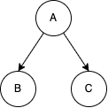
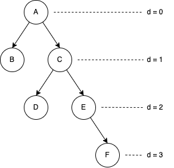
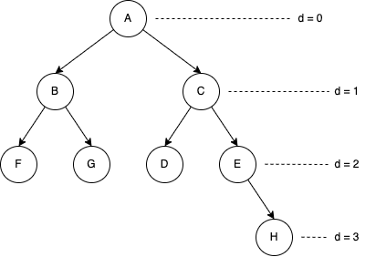
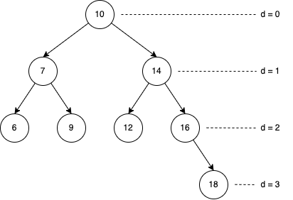
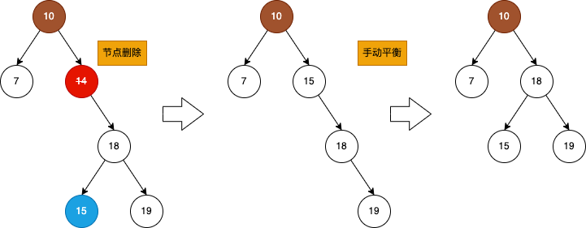
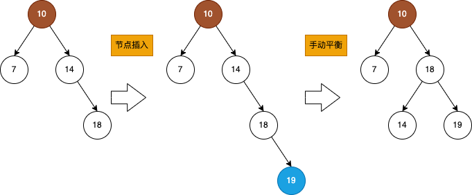

# Java Collection / Java 集合类

* Data Type
  - Atomic related type
    + Thread-safe and CAS
  - Hashtable, HashMap and concurrentHashMap
  - BlockingQueue and ConcurrentLinkedQueue
  - Binary Search Tree

- Q: Java 中 == 与 equals？
- A: "==" 用来比较原始数据的值，和对象数据的内存地址 Object References，equals 可以用来比较对象的值，一般对于自定义对象，都是十分建议重写 equals() 和 hashcode() 方法的；
  + 自定义对象在使用 集合类的使用，尤其是 Hashtable 这种集合类，hashcode 会被用来查询 Bucket，之后会通过 equals() 来判断是否和 Bucket 内部的元素重复，不重复才会放到集合中;

- Collection 是接口，Collections 是工具类；
- Java Collection 的主要实现类型有 List，Set，注意 Map 不继承自 Collection；

## Stream Pipeline 流式处理

- 主要针对 Collection, List, Set 来使用；
- 处理分为：source, intermediate operations, terminal operations;
  + intermediate operations 只有在 terminal operation存在并且执行的时候才会执行，这称为 Lazy invocation;
- - Stream() 是逐个处理，parallelStream() 是并行处理，不保证顺序，但同时注意不能随意插入或者删除元素；

## Data Structure 基本数据结构

Array, LinkedList, (BT) Binary-tree 二叉树, Hashtable;

Abstract Data Type (ADT): Stack, Queue, List, Set, Map, Tree, \*Graph

### List, Set

__List__

- 常见的 List 有 ArrayList, LinkedList；
  + 其中 ArrayList 需要明确长度，但实际上会根据容量自动 grow() x2扩容；
  + LinkedList是无界的，双向链表；
- 不太常见的 Vector 底层是一个链表结构，同时是线程安全的，Stack 是 Vector的一个子类；

__Set__

- 常见的 Set 有 Hashset, TreeSet;
- Hashset 是典型的无序、唯一的元素集合，底层使用 HashMap 来实现的，其中每次添加元素的 put(value, PRESENT) 的 key 是当前元素，value 则类似占位符--当前对象本身（基本无意义）；
- TreeSet 是有序的元素集合，底层是使用了 红黑树来实现的；
- 对于 Set 集合，如果需要 O(1) 的增删查，则可以使用 Hashset，如果需要进行有序遍历，则可以转换成 Treeset 来使用；

### Hashtable, Hashmap, Concurrent Hashmap

||HashMap|HashTable|
|-|-|-|
|实现|Node<K,V>|Entry<K,V>|
|多线程|非线程安全|有同步块，线程安全|
|新节点插入方法|链表的尾部，或者树的叶子节点，之后会平衡树|链表的头部 newNode.next = existingNode|
|链表|链表超过8，就会升级成红黑树|只有链表|
|扩容|当总容量超过(>) threshold 的时候，会触发 resize() 进行两倍扩容，节点会呆在原地或者迁移一定offset到新的位置|当总容量达到(>=) threshold的时候，会触发 rehash() 进行两倍扩容，节点可能会进行迁移|

- Hashtable 是用 Entry<K,V> 实现的，HashMap 是使用 Node<K,V> 实现的，Node 本身继承自 Map.Entry;
  + Hashmap 的链表在超过一定长度（8）之后，会升级成红黑树；
- Hashmap 的节点插入是 插入到链表的尾部，或者Tree的叶子节点，最后会通过这个办法平衡树:
- >moveRootToFront(tab, balanceInsertion(root, x));
- Hashtable 的新节点插入是 头插法；

- Hashmap 快但是非线程安全，Hashtable 慢但是线程安全；
  + Hashmap 和 Hashtable 查找最快 O(1) -- 即 hash() 之后的bucket 直接就是元素，最慢情况下，Hashtable 的bucket 中是长链表需要遍历，这时候是 O(n)，但是 Hashmap 在链表转换成 红黑树之后，可以达到 O(logn);
  
>更多细节，可以参考[HashMap 的实现原理](www.jianshu.com/p/c561bab28e19)

__ConcurrentHashmap__

- CHM 也是线程安全的，在 JDK 1.8 之前，使用 segment 和 ReentrantLock 实现 分段锁；
- 在 JDK 1.8，使用 CAS 和 Synchronized 来实现线程安全；
  + 具体说来，如果 hash() 之后 当前bucket是空的，则通过 CAS 来直接操作当前 bucket，否则 会通过 synchronized 来锁住当前 tabAt() 得到的 tab (? 我的理解，就是当前bucket 内容)，之后遍历找到目标元素；
  + 从 ReentrantLock 到 Synchronized 的变化，也可能意味着 使用ReentrantLock 会带来风险，使用 Sync 会降低并发问题带来的风险；

### Binary-Tree 二叉树

```java
public class Node {
  Node leftChild; // 指向左节点
  Node rightChild; // 指向右节点
}
```

- 二叉树的父节点最多有左右两个孩子节点（二叉的含义）；
- Bt的叶子节点没有孩子；


- Size of BT is number of elements(nodes) 二叉树的 Size 等于所有节点数;
- Depth of given N node is number of links between the root node and the N node 二叉树的某一个节点的深度是它到 root node 的 link 数目;
- Depth of a Bt is the depth of its deepest node 二叉树的深度是最深的节点的深度;



- 非平衡二叉树的最大深度 d=n-1，可以看作所有节点都在一条线上（减1是因为d是从0开始计数的）;



Balanced Binary-tree 平衡二叉树的条件是：d-1 的深度的孩子全部存在，或者说 d-2 深度的节点都有两个孩子，除上述条件外，都是非平衡二叉树；

- 其中，2^d 是当前深度最大节点数量，2^d+1 - 1 是所有节点最大数量；
- 所以，平衡二叉树的最大深度 d = floor(log2 N), N 是所有节点数量；

- __平衡树的作用重点会体现在二叉搜索树及其衍生树上__；

__BT 的遍历__

因为可以比较，所以可以按照左中右，中左右，左右中这样的顺序进行遍历输出，同时递归方法上也满足使用 树 Tree 的遍历方式进行遍历：
- __广度优先__ Breadth-first seach，每层进行遍历，之后在进行下层遍历，可以使用 Queue 来实现；
- __深度优先__ Depth-first search，每次对子树进行遍历，之后在进行父节点遍历，可以使用 Stack 来实现；

#### BST Binary-search tree 二叉搜索树

- 二叉树的特性基本都适用于二叉搜索树；
- 不同于 BT 二叉树，BST 节点之间可以进行比较：左节点一定比中间节点小，右节点一定比中间节点大；
  + 所以 BST 二叉搜索树 是有序的；

__BST 搜索__

BST 可以通过递归来实现对树的搜索/查找:
```text
if current == null, return none;
else if target = current, return current; (success)
else if target < current, set current = current.leftChild;
else if target > current, set current = current.rightChile;
```

__Balanced BST 平衡二叉搜索树__



当 d - 1 的节点全部存在的时候，就是平衡的 BST。

__查询/搜索的效率__

如果是普通的二叉树，需要遍历全部的节点来查询，但如果是二叉搜索树，则可以通过递归比较来加快查询。

二叉搜索树的查询时间复杂度(Time Complexity):
- Best Case，Balanced BST: O(logN);
- Worst Case, Unbalanced BST: O(N);

>BST 的查询可以看作二分查找法，所以有 logN 的效率。

__插入节点/删除节点__



- 因为 BST 是可以比较的，所以一定可以找到一个合适的 NULL 叶子节点，进行添加新节点操作；
- 同样，通过比较也可以方便地找到需要删除的节点，但：
  + 如果删除的是叶子节点，则直接删除，留 NULL；
  + 如果删除的是父节点或者Root节点，则需要将 __右侧子树中最左边的孩子节点移动到该父节点__，可以参考上图；



- 插入节点或者删除节点可能会使得平衡 BST 变成不平衡树，这时候的查询效率随着不平衡情况变严重会越来越低；
- 如果可以一直保持平衡，则可以保证它的查询一直高效；
  + 这就是 self-balancing 自动平衡 的好处，典型的例子比如 红黑树，B/B+ 树；

Java 中的 TreeSet，TreeMap 使用了红黑树，从而保证了时间复杂度一直是 O(logN);

#### \*RedBlack Tree 红黑树

红黑树是二叉搜索树的典型应用，它是一种自平衡的树，目的是为了保持高效的查询/搜索效率，在 Java 中主要用在 __HashMap__, __TreeSet__, __TreeMap__ 中。

红黑树的建立和维护需要满足以下条件：
- 红黑树的节点要么是黑色，要么是红色；
- Root 节点一定是黑色的，新建立的叶子节点是红色的；
- 如果出现 红-红 节点（孩子和父节点都是红色）：
  + 如果 Uncle 节点（父亲的兄弟节点）是红色，则执行变色：Uncle & Parent to Black, GrandFather to Red (or stays Black if it's root node);
  + 如果 Uncle 节点是黑色，则执行变化和变色：
    * 旋转包括左旋/右旋/调换Swap，目的是先平衡包括自身的三个相邻节点（从线形变成小三角）；
    * Swapping的时候，也需要将颜色互换，即 父节点和子节点互换位置和颜色；
- 红黑树插入变化示例：[Red-Black Tree Insertion](../assets/images/rbt.insertion.png)
- 详细变化规则可以参考：[Red-Black Tree Rules](https://www.geeksforgeeks.org/red-black-tree-set-2-insert/)

所以，红黑树是使用颜色来确保树的平衡的(to ensure the tree is balanced during any operations)。

### Tree 树

树是一种抽象数据类型 ADT(Abstract Data Type)。

```java
public class TreeNode {
  TreeNode parent; // 指向父节点
  TreeNode nextChild; // 指向下一个兄弟节点
  TreeNode Child; // 指向子节点
}
```

#### \*B Tree / B+ Tree

- B/B+树 都是平衡树，同时也都是有序的；
- 不同于 BST 二叉搜索树，B/B+ 树 每个节点有最多 2～m 个孩子（称为m阶，比如3阶 意味着可以有0/1/2/3个孩子）；
- B/B+树 在不平衡的时候会通过给节点升级（抬高节点的深度）来平衡树结构；
- B树 和 B+树 的区别有：
  + B树的数据在所有的节点上，但是B+树的数据只在叶子节点上，非叶子节点只是索引；
  + B树 查询需要查到当前节点，B+树 查询需要找到叶子节点；
  + B树 查询一个节点，会通过查询 中节点-左节点-回到中节点-右节点-回到中节点-回到父节点-下一个兄弟节点-等等 顺序来查询，虽然因为树结构提高了查询效率，但是因为每一个节点都是数据节点（读取磁盘），所以 IO 消耗依然比较大；
  + B+树 所有的非叶子节点都是索引节点，所以可以不仅拥有高效查询效率，同时也大大降低读取数据节点，减少了IO，同时，B+树 的数据节点是有指针连接的，可以直接片段读取数据，更加提高了读取效率；
    * 这是为什么 B+ 树更适合做 __数据库索引__；
- 更详细的信息可以参考这篇博客: [数据结构之B树与B+树](https://www.jianshu.com/p/cf7dba86c391)

## Atomic 类型

- 最核心的就是 CompareAndSet() 方法，底层是使用 unsafe.compareAndSwap();

